# K-CUBE Database ERD and Schema

Prepared: 2026-05-30

## Purpose

This document defines the structural database foundation for K-CUBE before UI screen development. It maps members, authentication, points, K-Food activity, events, Google Workspace integration, learning, rewards, CMS operations, and admin audit data into one MySQL-backed platform model.

Canonical implementation file today: `database/schema.sql`

## Current Architecture Decision

K-CUBE currently uses MySQL through the Node.js backend (`mysql2/promise`). The attached `User.js` Mongoose example should not be copied in as a parallel MongoDB model. Its concepts map into the existing relational model:

| User.js concept | K-CUBE MySQL destination |
| --- | --- |
| User identity/profile | `users` |
| Password/Google/OTP auth | `auth_identities`, `users.password_hash`, `users.google_id` |
| Points balance | `users.points` |
| Points history | `point_transactions` |
| Referral information | `users.referral_code`, `referrals` |
| Roles/admin access | `users.role`, `users.category_access` |
| Login/session audit | `session_logs` |

## Core ERD

```mermaid
erDiagram
  users ||--o{ auth_identities : owns
  users ||--o{ session_logs : creates
  users ||--o{ otp_requests : receives
  users ||--o{ referrals : referrer
  users ||--o{ referrals : referred
  users ||--o{ point_transactions : earns
  users ||--o{ activities : performs
  users ||--o{ lesson_progress : studies
  lessons ||--o{ lesson_progress : tracked_by
  users ||--o{ content_uploads : submits
  users ||--o{ content_uploads : reviews
  users ||--o{ kfood_clicks : clicks
  users ||--o{ kfood_purchases : claims
  users ||--o{ kfood_purchases : reviews
  users ||--o{ user_rewards : earns
  rewards ||--o{ user_rewards : assigned_to
  users ||--o{ chapters : leads
  chapters ||--o{ chapters_members : has
  users ||--o{ chapters_members : joins
  cms_pages ||--o{ cms_blocks : contains
  users ||--o{ cms_pages : creates
  users ||--o{ admin_audit_logs : triggers
  users ||--o{ engagement_events : emits
  users ||--o{ search_history : searches
  users ||--o{ platform_event_rsvps : registers
  platform_events ||--o{ platform_event_rsvps : receives
  platform_events ||--o{ google_calendar_sync_jobs : syncs
  google_calendar_connections ||--o{ google_calendar_sync_jobs : runs

  users {
    bigint id PK
    varchar full_name
    varchar username UK
    varchar email UK
    varchar phone
    varchar password_hash
    varchar google_id
    enum role
    enum category_access
    int xp
    int points
    int level
    json badges
    int streak
    int korea_score
    varchar referral_code UK
    enum status
    datetime created_at
  }

  auth_identities {
    bigint id PK
    bigint user_id FK
    enum provider
    varchar provider_user_id
    varchar email
    varchar phone
    boolean verified
    datetime created_at
  }

  point_transactions {
    bigint id PK
    bigint user_id FK
    enum source_type
    varchar source_slug
    int points_delta
    int balance_after
    enum status
    json metadata
    bigint created_by FK
    datetime created_at
  }

  kfood_purchases {
    bigint id PK
    bigint user_id FK
    varchar order_id UK
    decimal order_total
    varchar coupon_code
    enum status
    int points_reward
    bigint reviewed_by FK
  }

  platform_events {
    bigint id PK
    varchar slug UK
    varchar title
    text description
    enum category
    datetime starts_at
    datetime ends_at
    varchar timezone
    varchar location_name
    varchar google_calendar_event_id
    enum sync_status
    bigint created_by FK
  }

  platform_event_rsvps {
    bigint id PK
    bigint event_id FK
    bigint user_id FK
    enum status
    int points_reward
    datetime checked_in_at
  }

  google_calendar_connections {
    bigint id PK
    enum connection_type
    varchar google_subject_email
    varchar calendar_id
    json scopes
    enum status
  }

  google_calendar_sync_jobs {
    bigint id PK
    bigint connection_id FK
    bigint event_id FK
    enum operation
    enum status
    text error_message
    datetime started_at
    datetime completed_at
  }
```



## Implemented Tables

The current schema already includes these production-relevant foundations:

| Area | Tables |
| --- | --- |
| Identity/auth | `users`, `auth_identities`, `otp_requests`, `session_logs` |
| Points/gamification | `point_transactions`, `activities`, `rewards`, `user_rewards` |
| Referrals | `referrals` |
| Learning | `lessons`, `lesson_progress` |
| K-Food | `kfood_clicks`, `kfood_purchases` |
| Community | `chapters`, `chapters_members` |
| CMS/search/admin | `cms_pages`, `cms_blocks`, `search_index`, `search_history`, `admin_announcements`, `admin_audit_logs` |
| Risk/analytics | `fraud_events`, `engagement_events` |

## Required Additions for Google Calendar Events

The current schema has event-like points support but does not yet have a first-class event catalog or Google Calendar sync tables. Add these before building full event screens.

```sql
CREATE TABLE platform_events (
  id BIGINT UNSIGNED NOT NULL AUTO_INCREMENT,
  slug VARCHAR(255) NOT NULL UNIQUE,
  title VARCHAR(255) NOT NULL,
  description TEXT DEFAULT NULL,
  category ENUM('k_culture','k_food','learning','community','trip','partner') NOT NULL DEFAULT 'community',
  starts_at DATETIME NOT NULL,
  ends_at DATETIME NOT NULL,
  timezone VARCHAR(80) NOT NULL DEFAULT 'Asia/Kolkata',
  location_name VARCHAR(255) DEFAULT NULL,
  location_address TEXT DEFAULT NULL,
  online_meeting_url VARCHAR(1024) DEFAULT NULL,
  capacity INT UNSIGNED DEFAULT NULL,
  points_reward INT UNSIGNED NOT NULL DEFAULT 0,
  status ENUM('draft','published','cancelled','completed') NOT NULL DEFAULT 'draft',
  google_calendar_id VARCHAR(255) DEFAULT NULL,
  google_calendar_event_id VARCHAR(255) DEFAULT NULL,
  google_calendar_html_link VARCHAR(1024) DEFAULT NULL,
  sync_status ENUM('not_synced','synced','pending','failed') NOT NULL DEFAULT 'not_synced',
  sync_error TEXT DEFAULT NULL,
  created_by BIGINT UNSIGNED DEFAULT NULL,
  updated_by BIGINT UNSIGNED DEFAULT NULL,
  created_at DATETIME NOT NULL DEFAULT CURRENT_TIMESTAMP,
  updated_at DATETIME NOT NULL DEFAULT CURRENT_TIMESTAMP ON UPDATE CURRENT_TIMESTAMP,
  PRIMARY KEY (id),
  INDEX idx_platform_events_status_time (status, starts_at),
  CONSTRAINT fk_platform_events_created_by FOREIGN KEY (created_by) REFERENCES users(id) ON DELETE SET NULL,
  CONSTRAINT fk_platform_events_updated_by FOREIGN KEY (updated_by) REFERENCES users(id) ON DELETE SET NULL
) ENGINE=InnoDB DEFAULT CHARSET=utf8mb4;

CREATE TABLE platform_event_rsvps (
  id BIGINT UNSIGNED NOT NULL AUTO_INCREMENT,
  event_id BIGINT UNSIGNED NOT NULL,
  user_id BIGINT UNSIGNED NOT NULL,
  status ENUM('registered','waitlisted','cancelled','attended','no_show') NOT NULL DEFAULT 'registered',
  points_reward INT UNSIGNED NOT NULL DEFAULT 0,
  checked_in_at DATETIME DEFAULT NULL,
  created_at DATETIME NOT NULL DEFAULT CURRENT_TIMESTAMP,
  updated_at DATETIME NOT NULL DEFAULT CURRENT_TIMESTAMP ON UPDATE CURRENT_TIMESTAMP,
  PRIMARY KEY (id),
  UNIQUE KEY uniq_event_user (event_id, user_id),
  INDEX idx_rsvp_user (user_id),
  CONSTRAINT fk_rsvp_event FOREIGN KEY (event_id) REFERENCES platform_events(id) ON DELETE CASCADE,
  CONSTRAINT fk_rsvp_user FOREIGN KEY (user_id) REFERENCES users(id) ON DELETE CASCADE
) ENGINE=InnoDB DEFAULT CHARSET=utf8mb4;

CREATE TABLE google_calendar_connections (
  id BIGINT UNSIGNED NOT NULL AUTO_INCREMENT,
  connection_type ENUM('admin_oauth','service_account_domain_delegation') NOT NULL,
  google_subject_email VARCHAR(255) DEFAULT NULL,
  calendar_id VARCHAR(255) NOT NULL,
  scopes JSON NOT NULL,
  status ENUM('active','revoked','disabled') NOT NULL DEFAULT 'active',
  created_by BIGINT UNSIGNED DEFAULT NULL,
  created_at DATETIME NOT NULL DEFAULT CURRENT_TIMESTAMP,
  updated_at DATETIME NOT NULL DEFAULT CURRENT_TIMESTAMP ON UPDATE CURRENT_TIMESTAMP,
  PRIMARY KEY (id),
  INDEX idx_calendar_connection_status (status),
  CONSTRAINT fk_calendar_connection_created_by FOREIGN KEY (created_by) REFERENCES users(id) ON DELETE SET NULL
) ENGINE=InnoDB DEFAULT CHARSET=utf8mb4;

CREATE TABLE google_calendar_sync_jobs (
  id BIGINT UNSIGNED NOT NULL AUTO_INCREMENT,
  connection_id BIGINT UNSIGNED NOT NULL,
  event_id BIGINT UNSIGNED NOT NULL,
  operation ENUM('insert','update','delete','pull_incremental') NOT NULL,
  status ENUM('queued','running','succeeded','failed') NOT NULL DEFAULT 'queued',
  google_calendar_event_id VARCHAR(255) DEFAULT NULL,
  request_payload JSON DEFAULT NULL,
  response_payload JSON DEFAULT NULL,
  error_message TEXT DEFAULT NULL,
  started_at DATETIME DEFAULT NULL,
  completed_at DATETIME DEFAULT NULL,
  created_at DATETIME NOT NULL DEFAULT CURRENT_TIMESTAMP,
  PRIMARY KEY (id),
  INDEX idx_sync_event (event_id),
  INDEX idx_sync_status (status),
  CONSTRAINT fk_sync_connection FOREIGN KEY (connection_id) REFERENCES google_calendar_connections(id) ON DELETE CASCADE,
  CONSTRAINT fk_sync_event FOREIGN KEY (event_id) REFERENCES platform_events(id) ON DELETE CASCADE
) ENGINE=InnoDB DEFAULT CHARSET=utf8mb4;
```

## Google SSO Data Model

Google Single Sign-On should be represented in `auth_identities`:

| Field | Value |
| --- | --- |
| `provider` | `google` |
| `provider_user_id` | Google OIDC `sub` claim |
| `email` | Verified Google account email |
| `verified` | `true` only when Google confirms `email_verified` |

Recommended policy:

- Keep `users.google_id` temporarily for backward compatibility.
- Treat `auth_identities.provider_user_id` as the long-term canonical Google identity.
- Never trust a raw `google_id` posted by the browser. Backend must verify an ID token or exchange an authorization code server-side.

## Google Calendar Data Model

Calendar sync should be controlled by backend-owned records:

- `platform_events` is K-CUBE's source of truth for event title, timing, location, RSVP capacity, reward points, and publishing status.
- `google_calendar_connections` stores which Google calendar K-CUBE syncs to.
- `google_calendar_sync_jobs` stores every attempted push/pull operation for audit and retry.
- Google event IDs are stored on `platform_events.google_calendar_event_id`.

## Points Rules

- `users.points` is a cached current balance.
- `point_transactions` is the immutable ledger and audit source.
- Event attendance points should use `source_type = 'event'` and `source_slug = 'event-rsvp-{event_id}'` or `event-attendance-{event_id}`.
- K-Food approved purchases should use `source_type = 'kfood'`.
- Referral, welcome, lesson, upload, admin adjustment, and redemption points should remain idempotent by `source_type + source_slug`.

## App.js Integration Review

The provided `App.js` React Router idea maps to the existing frontend, but this project uses Next.js App Router, not a standalone `react-router-dom` app. The route mapping should be:

| App.js route concept | Existing Next.js route |
| --- | --- |
| Home | `frontend/src/app/page.tsx` |
| Sign in | `frontend/src/app/signin/page.tsx` |
| Sign up | `frontend/src/app/signup/page.tsx` |
| Dashboard | `frontend/src/app/dashboard/page.tsx` |
| Events | `frontend/src/app/events/page.tsx` and `frontend/src/app/events/[slug]/page.tsx` |
| Learning | `frontend/src/app/learning/page.tsx` and `frontend/src/app/learning/[slug]/page.tsx` |
| K-Food | `frontend/src/app/kfood/page.tsx` and `frontend/src/app/kfood/[slug]/page.tsx` |
| Rewards | `frontend/src/app/rewards/page.tsx` and `frontend/src/app/rewards/[slug]/page.tsx` |
| Admin | `frontend/src/app/admin/page.tsx` |

## Source References

- Google Identity Services and OAuth for web apps: https://developers.google.com/identity/oauth2/web/guides/how-user-authz-works
- Google OAuth 2.0 web server flow: https://developers.google.com/identity/protocols/oauth2/web-server
- Google Calendar events API: https://developers.google.com/workspace/calendar/api/v3/reference/events/insert
- Google Calendar sync guidance: https://developers.google.com/workspace/calendar/api/guides/sync
- Google Workspace domain-wide delegation: https://support.google.com/a/answer/162106
